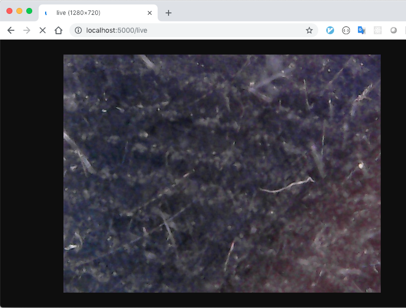

### 1. install requirement
pip install -r requirements.txt

### 2. run server on public server
python run.py

### 3. run script to send intranet camera image to remote server
python post_image.py

### 4. access live feed
http://your-ip:5000/live

